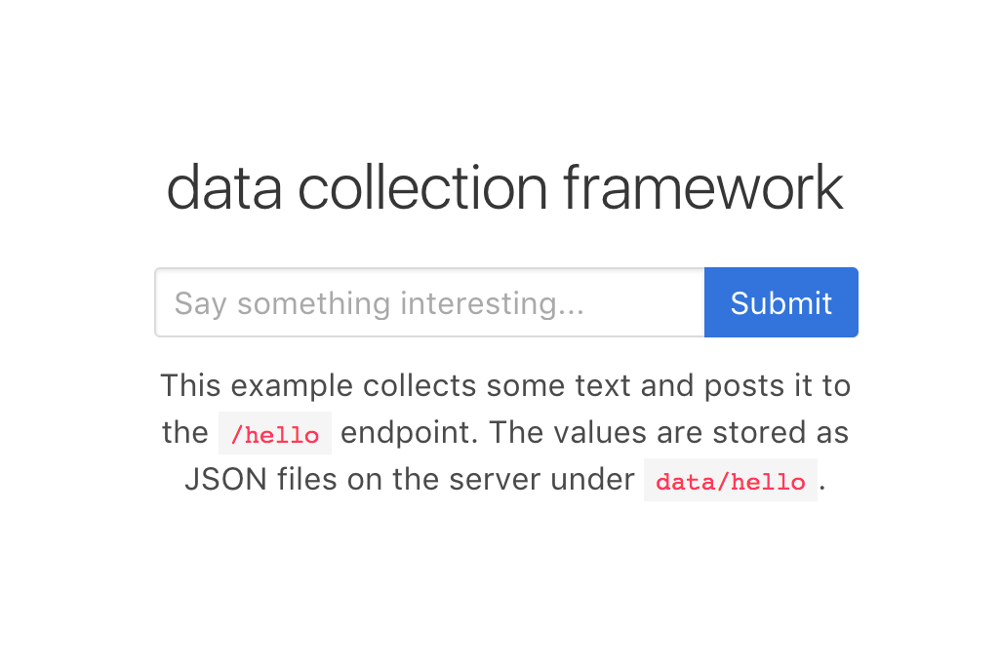

# kevz-dcf
This is a really simple web application for collecting data.



## usage
```
$.ajax({
    type: "POST",
    url: "/api/<endpoint>",
    data: JSON.stringify({"hello": "world"}),
    contentType: "application/json; charset=utf-8",
    dataType: "json",
    complete: function() {
        console.log("done")
        alert("success!");
        window.location.reload();
    }
});
```
